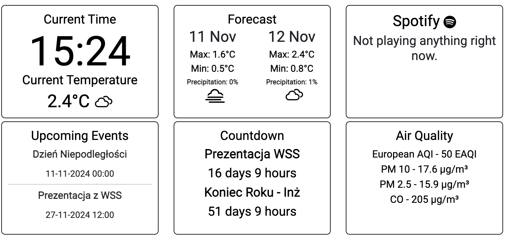

# ePapier PHP (Symfony)

Repozytorium odpowiedzialne za część projektu wykorzystującą język PHP w frameworku Symfony.



> [!IMPORTANT]
> Projekt znajduje się w fazie rozwoju i nie stanowi wersji finalnej. W bieżącej wersji mogą występować błędy oraz niedociągnięcia logiczne, które będą poprawiane w przyszłych aktualizacjach.
>
> Dokumentacja również jest w trakcie tworzenia i może być uzupełniana wraz z postępem prac nad projektem.

## Cel projektu

Aby stworzyć interfejs graficzny wyświetlający zawartość na ekranie ePapier, zdecydowałem się na budowę aplikacji webowej w PHP przy użyciu frameworka Symfony. Projekt pełni również rolę edukacyjną, umożliwiając naukę pracy w Symfony.

## Funkcjonalności

Domyślnie na stronie głównej znajduje się interfejs wyświetlany na ekranie ePapier. Jak widać na zrzucie ekranu wyżej ma formę bardzo prostą - ze względu na ograniczenia techinczne zawartość musi być prosta, czytelna oraz czarno-biała.

Za to na podstronie `/settings` znajduje się panel sterowania umożliwiający zmianę treści wyświetlanych na ekranie. Można ustawić lokalizację pogody, dodać swoje konta np. Spotify, Google Calendar czy też dać dostęp do własnej instalacji fotowoltaicznej marki SolarEdge i inne rzeczy

## Zmienne środowiskowe

Przed uruchomieniem projektu należy utworzyć plik `.env` na podstawie pliku `.env.example` i uzupełnić go odpowiednimi wartościami:

    MESSENGER_TRANSPORT_DSN=doctrine://default?auto_setup=0
    DATABASE_URL="sqlite:///%kernel.project_dir%/var/data.db"

    ## Google API
    GOOGLE_CLIENT_ID=
    GOOGLE_PROJECT_ID=
    GOOGLE_AUTH_URI=
    GOOGLE_TOKEN_URI=
    GOOGLE_AUTH_PROVIDER_CERT_URL=
    GOOGLE_CLIENT_SECRET=

    ## Spotify API
    SPOTIFY_CLIENT_ID=
    SPOTIFY_CLIENT_SECRET=

    ## Adres do przekierowywania spoza localhost (ustaw nazwę domeny zgodną z ustawieniami w Cloudflare w projekcie Python, np. local.example.com)
    REDIRECT_URL=

    # Klucz szyfrowania - domyślnie generowany automatycznie przy pierwszym uruchomieniu (plik var/encryption.key)
    # ENCRYPTION_KEY=

> [!NOTE]
> Wersja produkcyjna dostarcza domyślne (puste) wartości dla zmiennych zewnętrznych, dzięki czemu kontener uruchamia się nawet bez skonfigurowanego Spotify/Google. Uzupełnij je w `.env`, aby aktywować integracje.

## Instalacja

Projekt można uruchomić na dwa sposoby:

### 1) Wersja produkcyjna (Docker)

- Uruchom za pomocą komendy:

  ```bash
  docker compose -f "compose.yaml" up -d --build production-server
  ```

- Jeśli chcesz wstrzyknąć konfigurację z pliku `.env` (np. w środowisku produkcyjnym z własnym certyfikatem internal TLS), użyj przygotowanego pliku `compose.prod.yaml`:

  ```bash
  docker compose -f "compose.prod.yaml" up -d --build production-server
  ```

- Wersja produkcyjna zapisuje bazę SQLite w wolumenie `app_data` montowanym do katalogu `var/`, dzięki czemu dane przetrwają restarty kontenera.

- Alternatywnie, utwórz obraz, a następnie kontener, udostępniając trzy porty:
  - 80
  - 443
  - 443/udp

### 2) Wersja deweloperska

a) Wymagane jest zainstalowanie PHP oraz zależności poprzez Composer. `ENCRYPTION_KEY` zostanie wygenerowany automatycznie przy pierwszym użyciu (jeśli chcesz użyć własnego, dodaj go do pliku `.env`).

b) Uruchom serwer Symfony przy użyciu Docker Compose:

```bash
docker compose -f "compose.yaml" up -d --build development-server
```

Zmienne środowiskowe dla wersji deweloperskiej powinny znajdować się w pliku `.env.dev`.

W obu przypadkach należy pamiętać o wygenerowaniu schematu bazy danych komendą (obraz produkcyjny robi to automatycznie na etapie budowy, ale lokalnie warto uruchomić ją ręcznie):

```bash
php bin/console doctrine:schema:update --force
```
